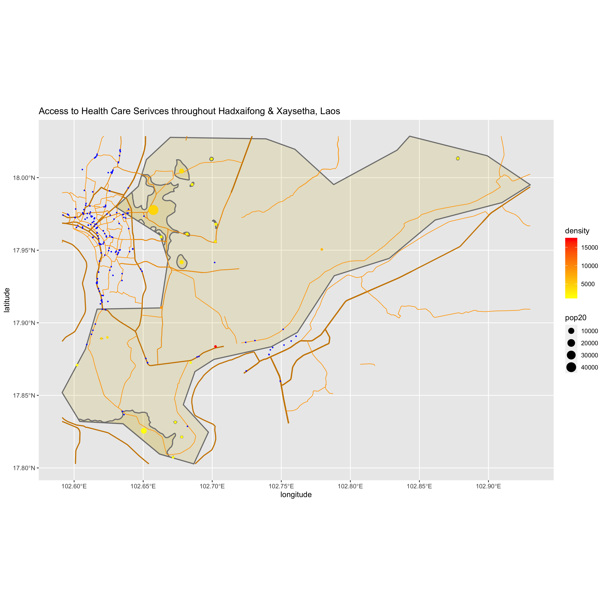
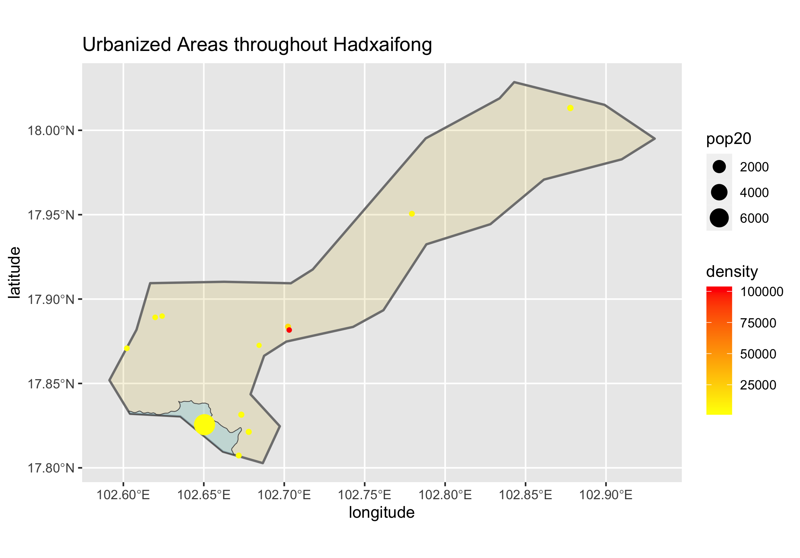
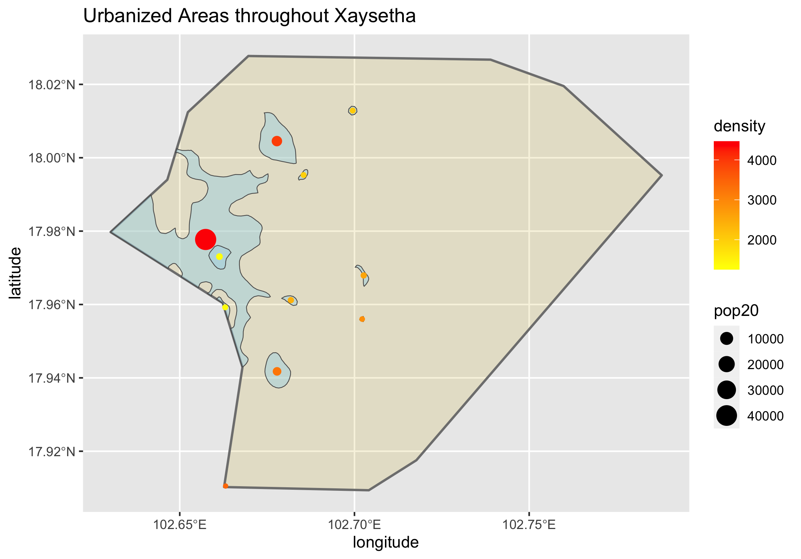
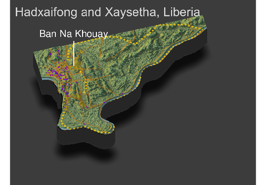

# Final Project

## De facto human settlements in Hadxaifong and Xaysetha, Laos

Hadxaifong and Xaysetha are two of the provinces that make up Vientiane prefecture. They also both sit just outside the capital city of Vientiane.
The population of Hadxaifong is 105,479:

And the population of Xaysetha is 98,391:

This brings the combined area's total population to 208,370. There appear to be 4 main urban centers within the total area, but the total number of smaller urban area seems to rise to about 17. Throughout the project, I had many errors and problems while trying to generate these plots, so the values for the densities are very high, however the color gradient still shows the relative density of these areas. The urban area in the northwest is the most dense, which makes sense considering it directly borders the capital city. It also has the highest population of all the urban areas. The next largest area in terms of population is the urban area in the south, which sits at the border between Laos and Thailand, however it is not as dense as some of the other urban areas. The remaining urban areas have much smaller populations but similar densities.

The roadways in the combined area seem to be strongly connected to the bordering capital city. The roads in the northwest mostly all lead to that capital city, though there are still roads connecting it to other places in the surrounding area. The urban area in the south only has one main road to connect itself to other places nearby. Although the number of roads may appear to be lacking, the plot only shows the major roads of the combined area, and not those that connect residential areas. However, I do still think that the area would be improved with more roads that better connected the smaller urban areas.

The feature that seems to need the most improvement is the area's health care facilities. The majority of health care facilities are located outside of the combined area and in the capital city. This may be acceptable for people living in the northwest, but the surrounding urban areas should have a greater number of health care facilities closer by. The urban area in the south only has three facilities in the immediate area, which is very problematic, as it does not provide adequate resources to many people living in this areas. The same can be said about many of the other urban areas throughout the combined region, who also do not seem to have great access to health care facilities. Furthermore, these areas do not have many hospitals or clinincs (blue and green in the plot), though they still do have doctors, pharmacies, and dentists (purple).

## 3D Plot of de facto human settlements

The topography of the combined area has not seemed to have a great impact on development. The settlements near the south and east seem to have been influenced by the river that runs along Laos's border, however, the development of the urban areas seem mostly due to the proximity to the capital city Vientiane. There are some slight ridges, which the roads seem to work around, but overall the area is quite flat, which poses less of a challenge when designing the roads to connect various areas. However as the terrain gets more varied--moving out away from the capital city--the urban areas, roadways, and health care facilities decrease. Producing the three-dimensional plot was helpful in providing a bigger picture on the urban developments in my selected area, but it does not provide much more explanation for the contruction of roads and health care facilites. Overall topography alone cannot explain the minor lack in health care facilities and roadways.
