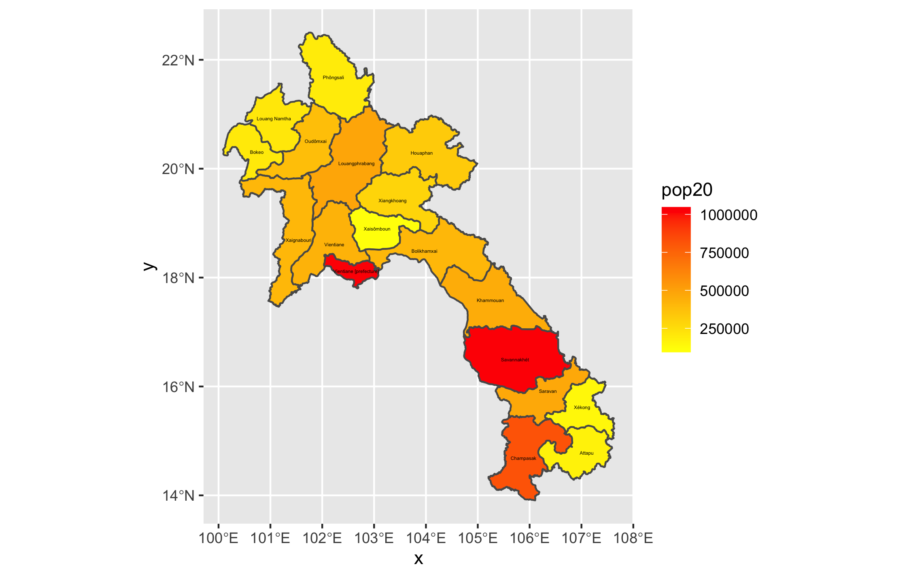
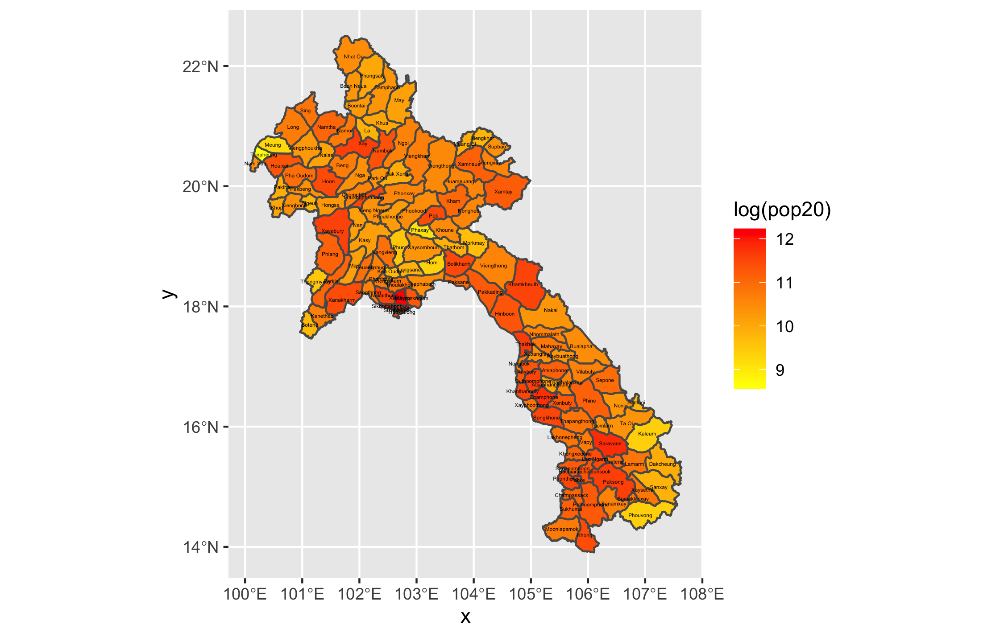
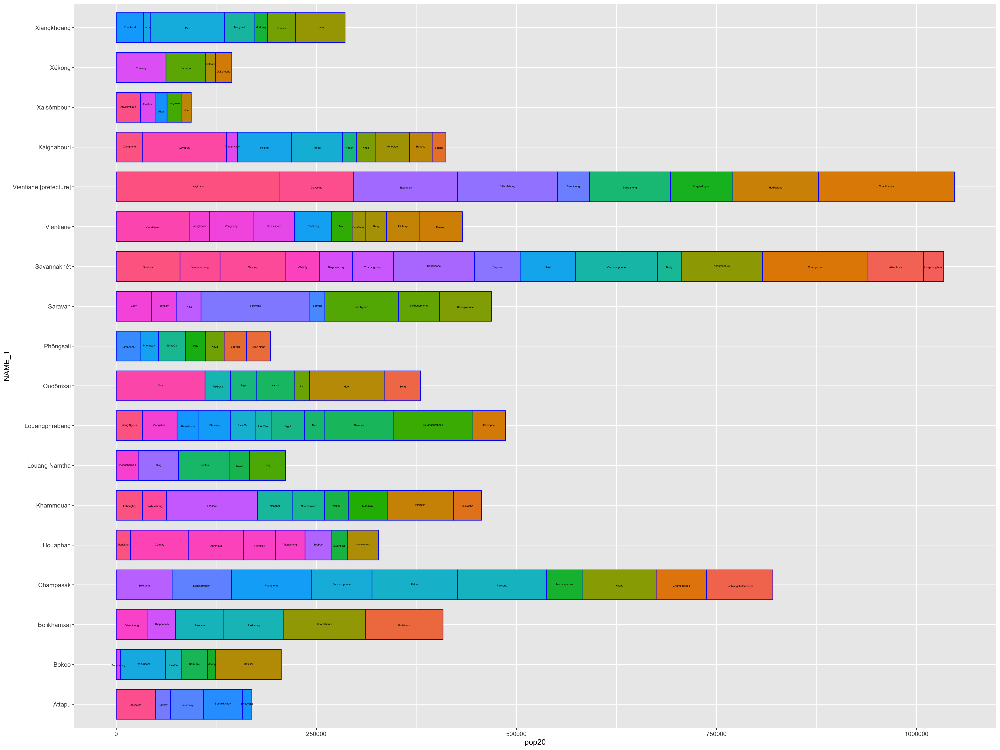

# Project 2
Overall project 2 went smoothly. I had a few minor errors or parts that I was confused on, but I worked through them and am happy with my final results. This one took a bit longer than project 1, mostly because of the number of plots I needed to produce.

## Laos Population Map - Challenge Question 1
This first plot shows the population in each of Laos's adm1 subdivisions. The most time-consuming part was just extracting the data from the raster, which took about 15 minutes on my computer. Otherwise creating the plot was not terribly difficult

## Stretch Goal 1 - adm2 Subdivisons
This plot shows the log of the populations now in Laos's second level subdivisions. Initially I forgot to include the log operator, but I later realized my mistake. Like the previous plot, the only bothersome part was waiting for the data to be extracted.

## Stretch Goal 2 - adm1 and adm2
This plot shows the log of the populations in the country's second level subdivisions, but it includes the adm1 divisions as well.

## Stretch Goal 3 - Rayshader
I had a lot of trouble trying to install the rayshader package, but after looking through the error messages and online forums I was able to install the package and create this plot. This is the same as the previous plot, except it shows the population values as the third dimension.

## Geometric Bar Plot
This plot combines the first plot with a bar plot of the population in each adm1 subdivision.

## Stretch Goal 1 - Detailed Bar Plot
Like the previous bar plot, this one shows the overall population in each adm1 subdivision, but now includes the adm2 subdivisons within those bars.

