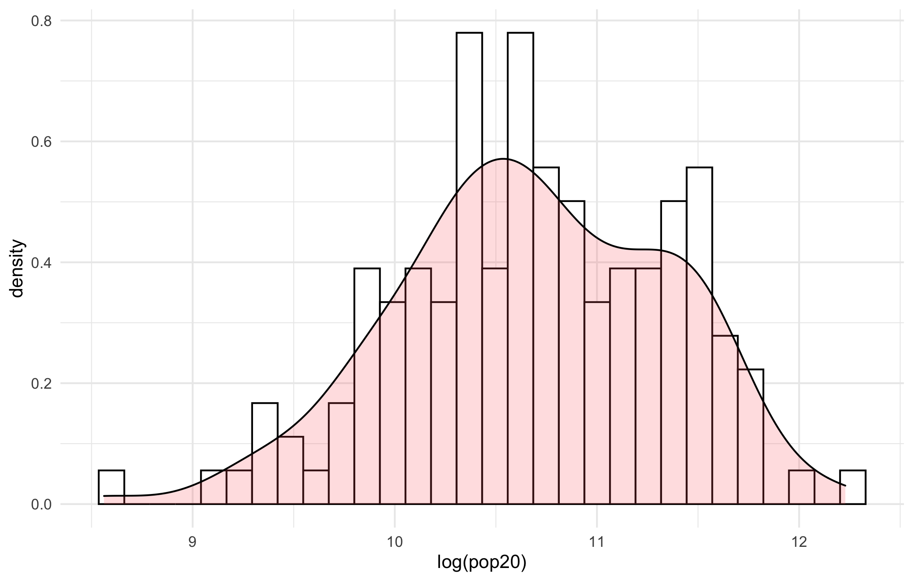
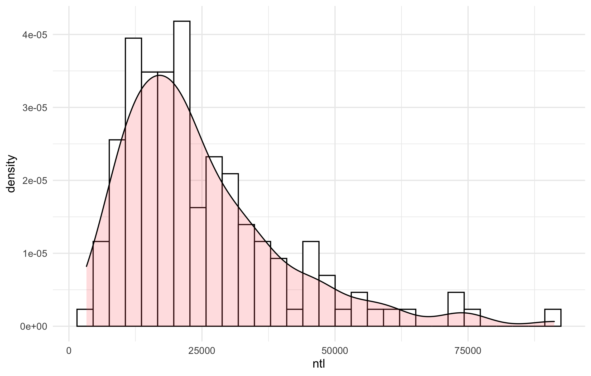
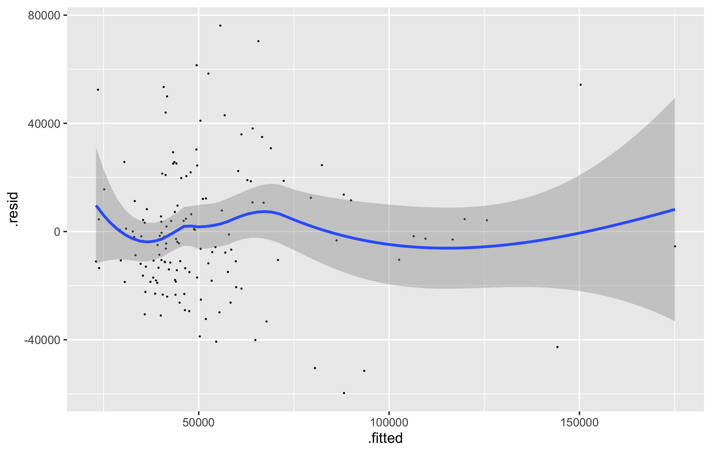
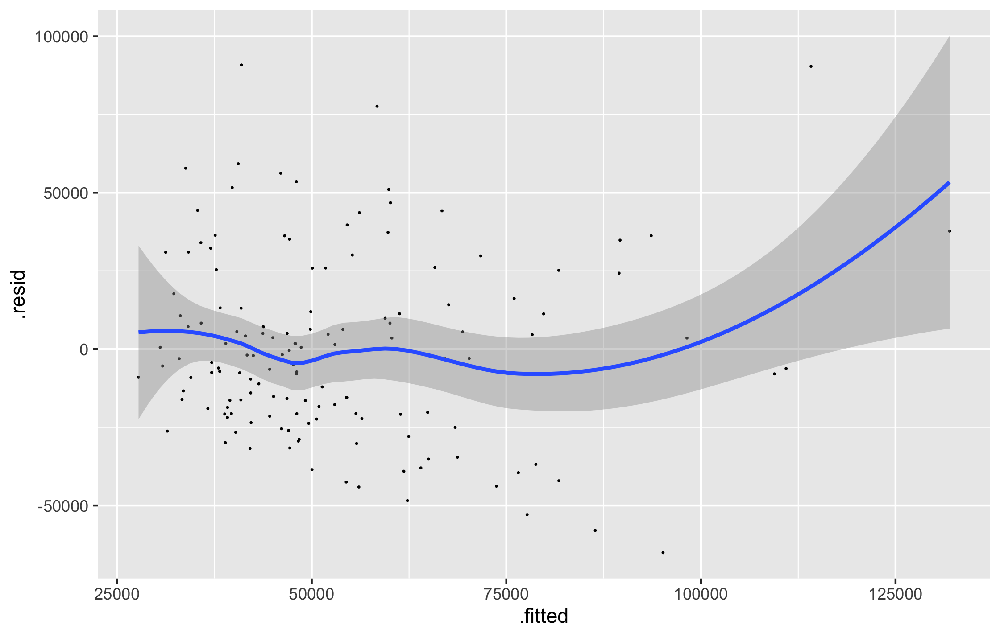

# Project 3

## Challenge Question 1
Below is the histogram with density plot that describes the relationship between density and the log of population at Laos's second-level subdivisions.

Below is the plot describing the relationship between density and sum of nighttime lights at the adm2 level.

## Challenge Question 2
The linear model below shows relationship between population and ntl, dst190, dst011, and dst200 combined. The R-Squared value for the plot is 0.4969, and the adjusted R-Squared is 0.4822. Although the relationship is not that strong, it was one of the highest R-Squared values I was able to find for my data.

The model below shows the relationship between population and nighttime lights. The R-Squared values is much lower at 0.1931, with adjusted at 0.1873. Again, thoug the relationship is not that strong, much of the other data was similar or much lower.

