# Project 4
## Investigating Margins of Error
In general in this project, RStudio had difficulty running with so many large objects, which caused the program to crash often and delete my files. This forced me to have to restart R, my computer, and the project multiple times. I did manage to fully generate the plots for the project, though they are not in the highest resolution, since I took screenshots of the plots so as not to overload RStudio and cause it to crash again.

This part of the project involved predicting population counts for each gridcell of my country, Laos. Then I had to compare the predicted values with the actual values of Laos by looking at areas of the country where the predicted values seemed off (in more highly populated areas). The plots below show the predicted sums of population for Vientiane prefecture and Savannakhét as well as the difference in predicted and actual population counts. Overall the difference did not seem that great, which suggests that the predicted values were extremely close to the actual values. While there may have been some error in my own code, I ran the program multiple times (with edits) and received similar results.
### Vientiane prefecture:
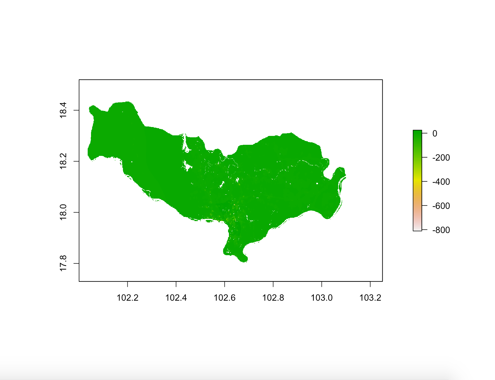
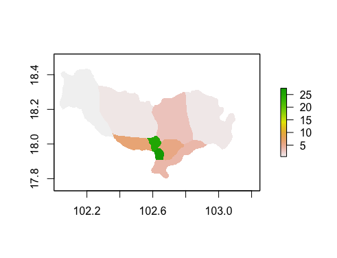
### Savannakhét:
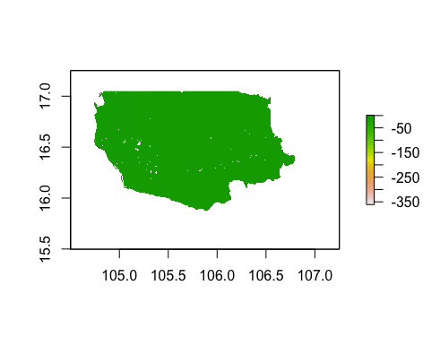
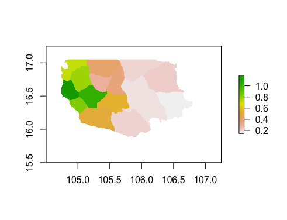
## Investigating and Comparing results
The second part of the project similarly involved generating the predicted values of the sum of population counts for Laos, but it also involved generating predicted values for the means of population as well as the log of population in combination with the predicted means. Again, I had difficulties running the program, but I was eventually successful in generating the plots. I wish I had saved the plots in higher resolution, but I was just happy to finally have a plot created after all the times RStudio crashed before I was able to generate anything. The plots similarly show that the predicted values were extremely close to the actual values, but there is still clear evidence of deviation from the actual values. Within the three kinds of predicted values, there are three plots: one showing the predicted values, one showing the difference between predicted and actual, and a 3D plot of these differences.
### Response variable is population and the predictors are sum of covariates:
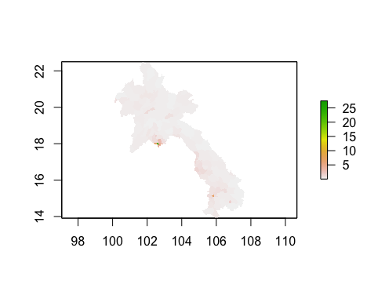

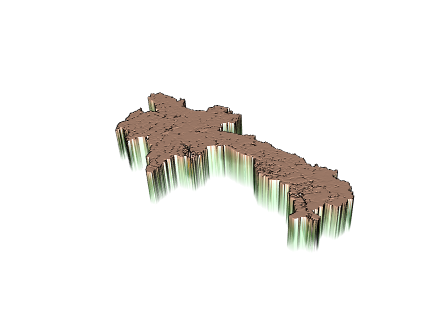
### Response variable is population and the predictors are mean of covariates:
This model seemed to have the best results, as the differences between the predicted and actual values appears very slight, and it returned the lowest value when cellStats(abs(diff_means), sum) was executed.

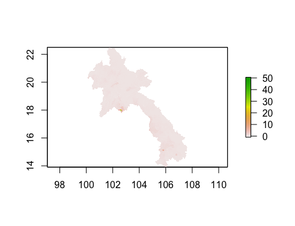

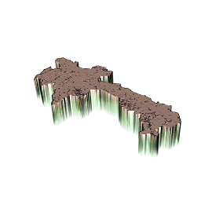
### Reponse variable is log of population and the predictors are mean of covariates:
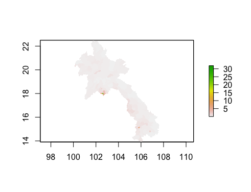
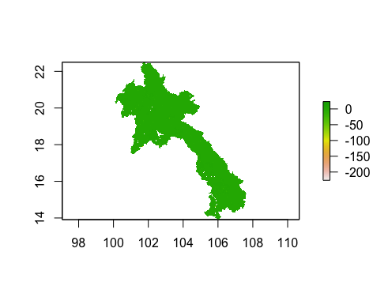
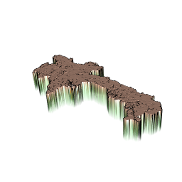
